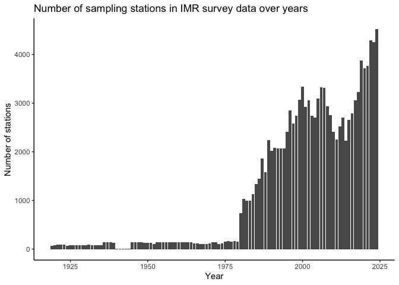

# BioticExplorer-Server
**R Package for Downloading Server-Side Data for BioticExplorer**

This package can be used to download IMR Biotic database and to place it into a [duckdb](https://duckdb.org/docs/api/r.html) database, providing access to all of the institute's Biotic data from R.

## Installation


``` r
remotes::install_github("DeepWaterIMR/BioticExplorerServer")
```

## Usage

### Download the IMR biotic database

The BioticExplorerServer package (BES) downloads and compiles the IMR database into a [duckdb](https://cran.r-project.org/package=duckdb) database. The download requires stable intranet access (VPN, cable within the institute web or HI-adm WiFi). The **database requires more than 2 Gb of disk space**. Make sure to modify the `dbPath` argument to choose an appropriate location for the database. **Do not store it in a folder that is synced to the cloud** due to its size, and be mindful of the [institute's data policy](https://www.hi.no/resources/Data-policy-HI.pdf). While most of the data is licensed under NLOD (the governmental version of CCBY), **some external data within the database must not be shared outside the institute**. **By using this package, you accept the responsibility of handling the IMR Biotic data according to the licenses and regulations**. It is advisable to run the download command in a separate R session or in a screen session in the terminal on Unix machines, as downloading the database takes several hours and requires a stable internet connection. If the connection is unstable, the function may return an error. In such cases, ensure that the connection is stable and rerun the command. The function should continue downloading from where it left off.


``` r
library(BioticExplorerServer)
compileDatabase(dbPath = "~/Documents/IMR_biotic_BES_database") # default dbPath, written out to show it
```

### Update the database

Currently, the entire database must be re-downloaded to update it because IMR Biotic database does not have last modified tags. To update the database, you can do the following:


``` r
library(BioticExplorerServer)
compileDatabase(dbPath = "~/Documents/IMR_biotic_BES_database",
                dbName = "bioticexplorer-next")
unlink(normalizePath("~/Documents/IMR_biotic_BES_database/bioticexplorer.duckdb"))
file.rename(
  normalizePath("~/Documents/IMR_biotic_BES_database/bioticexplorer-next.duckdb"),
  normalizePath("~/Documents/IMR_biotic_BES_database/bioticexplorer.duckdb", 
                mustWork = FALSE))
```

This process first downloads the database to a file named `bioticexplorer-next.duckdb`, then deletes the old database and renames `bioticexplorer-next.duckdb` to `bioticexplorer.duckdb`. Since downloading takes time, you can continue using the database in another R session while the download is in progress. If it is not a priority, you can also overwrite the existing database:


``` r
compileDatabase(dbPath = "~/Documents/IMR_biotic_BES_database", overwrite = TRUE)
```

### Uninstall the database

If you want to remove the database from your computer, simply delete the folder at the specified `dbPath`. Remember to empty your trash bin as well.

### Control the database through R

Once the database has been downloaded and saved to a [duckdb](https://cran.r-project.org/package=duckdb) database, you can use standard [DBI](https://cran.r-project.org/package=DBI) or [dplyr](https://cran.r-project.org/package=dplyr) functions to access it:


``` r
# Packages required to replicate the example:
packages <- c("tidyverse", "data.table", "DBI", "duckdb")

# Install packages not yet installed
installed_packages <- packages %in% rownames(installed.packages())
if (any(installed_packages == FALSE)) {
  install.packages(packages[!installed_packages])
}

# Load the packages
invisible(lapply(packages, library, character.only = TRUE, quietly = TRUE))

# Connect to the database (assuming you used standard dbPath and name)
con_db <- "~/Documents/IMR_biotic_BES_database/bioticexplorer.duckdb" %>% 
  normalizePath() %>% 
  duckdb::duckdb(read_only = TRUE) %>% 
  DBI::dbConnect()

## Create the data objects

stnall <- dplyr::tbl(con_db, "stnall") # station-based data
indall <- dplyr::tbl(con_db, "indall") # individual-based data
ageall <- dplyr::tbl(con_db, "ageall") # age data
mission <- dplyr::tbl(con_db, "mission") # information on
meta <- dplyr::tbl(con_db, "metadata") %>% # time of download
  collect() %>% mutate_all(as.POSIXct)
csindex <- dplyr::tbl(con_db, "csindex") # cruise series index
gearlist <- dplyr::tbl(con_db, "gearindex") %>% collect() # gear index
```

These data objects can now be used in R:


``` r
head(mission)
```

```
## # Source:   SQL [6 x 13]
## # Database: DuckDB v1.1.3 [root@Darwin 24.2.0:R 4.4.1//Documents/IMR_biotic_BES_database/bioticexplorer.duckdb]
##   startyear platformname               cruise missiontype platform missionnumber
##       <int> <chr>                      <chr>  <chr>       <chr>            <int>
## 1      1914 Ikke navngitte skip i kom… <NA>   1           1530                 1
## 2      1916 Ikke navngitte skip i kom… <NA>   1           1530                 1
## 3      1917 Ikke navngitte skip i kom… <NA>   1           1530                 1
## 4      1918 Ikke navngitte skip i kom… <NA>   1           1530                 1
## 5      1919 Ikke navngitte skip i kom… <NA>   1           1530                 1
## 6      1919 Uspesifisert Norsk skip    19190… 4           4999                 1
## # ℹ 7 more variables: missiontypename <chr>, callsignal <chr>,
## #   missionstartdate <chr>, missionstopdate <chr>, purpose <chr>,
## #   missionid <chr>, cruiseseriescode <chr>
```

The [dplyr package can also be used with databases](https://solutions.posit.co/connections/db/r-packages/dplyr/). The only difference from normal use is that you'll need to [`collect()`](https://dbplyr.tidyverse.org/reference/collapse.tbl_sql.html) the data from the database after filtering. Note that you are handling large amounts of data, and using the collect function incorrectly may cause your computer to crash due to insufficient RAM. Therefore, always filter before collecting and consider using [`compute()`](https://dbplyr.tidyverse.org/reference/collapse.tbl_sql.html) or use the [data.table](https://cran.r-project.org/web/packages/data.table/index.html) package, if you'll need to handle very large proportions of the IMR Biotic database. 


``` r
stnall %>% 
  filter(!is.na(cruise)) %>% 
  collect() %>% 
  group_by(startyear) %>%
  reframe(n = length(unique(paste(cruise, platformname, serialnumber)))) %>% 
  ggplot(aes(x = startyear, y = n)) +
  geom_col() + 
  labs(x = "Year", y = "Number of stations", 
       title = "Number of sampling stations in IMR survey data over years") +
  theme_classic()
```

<!-- -->

The duckdb database contains following data tables:


``` r
DBI::dbListTables(con_db)
```

```
## [1] "ageall"    "csindex"   "filesize"  "gearindex" "indall"    "metadata" 
## [7] "mission"   "stnall"
```

### Explore the database using Biotic Explorer shiny app

Once downloaded, you can also use the database through the [Biotic Explorer](https://github.com/DeepWaterIMR/BioticExplorer) shiny app. 

## Troubleshooting

If you get an error something like:

> Error:
> ! error in evaluating the argument 'drv' in selecting a method for function 'dbConnect':
> rapi_startup: Failed to open database: {"exception_type":"IO","exception_message":"Could not set lock on file
> ...

You likely have the database connection open elsewhere within your R session. Close those connections:


``` r
DBI::dbDisconnect(con_db)
```

and connect to the database in read only mode: `duckdb::duckdb(read_only = TRUE)`.
