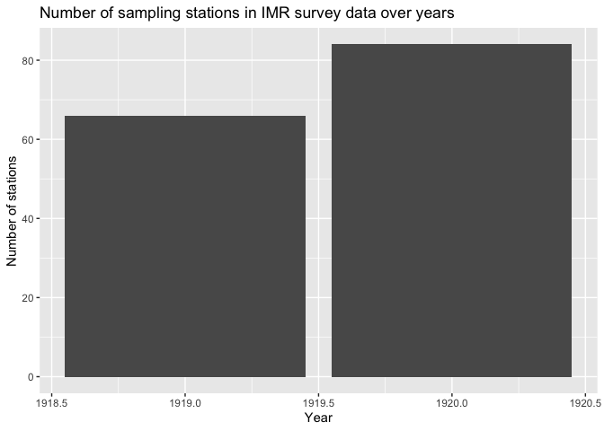

# BioticExplorer-Server
**R package to generate and update the server-side data for BioticExplorer**

This package can be used to download IMR Biotic database and to place it into a [duckdb](https://duckdb.org/docs/api/r.html) allowing an access to all institute's Biotic data from R.

## Installation


``` r
remotes::install_github("DeepWaterIMR/BioticExplorerServer")
```

## Usage

### Download IMR biotic database

Download and compile the IMR database to a [duckdb](https://cran.r-project.org/package=duckdb) database. Requires intranet access (VPN, cable within the institute web or HI-adm wifi). The **database takes 40 Gb of disk space**. Make sure to modify the `dbPath` argument to decide a fitting place for the database. **Do not** place it in a folder that gets synced to cloud due to the size and please mind the [institute data policy](https://www.hi.no/resources/Data-policy-HI.pdf). While the data are mostly licensed NLOD (governmental version of CCBY), there are some external data that should not be shared outside the institute. By using this package, you accept the responsibility of using IMR biotic data according to the licences and regulations. It is recommended to conduct the download command below in a separate R session or in a screen session in terminal on Unix machines as downloading the database takes several hours and requires a stable internet. If the connection is unstable, the function may return an error. In such a case, make sure that the connection is stable and rerun the command above. The function should continue downloading from where it crashed. 


``` r
library(BioticExplorerServer)
compileDatabase(dbPath = "~/Documents/IMR_biotic_BES_database")
```

To update the database, you can do the following:


``` r
library(BioticExplorerServer)
compileDatabase(dbPath = "~/Documents/IMR_biotic_BES_database",
                dbName = "bioticexplorer-next")
unlink(normalizePath("~/Documents/IMR_biotic_BES_database/bioticexplorer.duckdb"))
file.rename(normalizePath("~/Documents/IMR_biotic_BES_database/bioticexplorer-next.duckdb"),
            normalizePath("~/Documents/IMR_biotic_BES_database/bioticexplorer.duckdb", mustWork = FALSE))
```

This first downloads the database to a file called `bioticexplorer-next.duckdb`, then deletes the old database and renames `bioticexplorer-next.duckdb` to `bioticexplorer.duckdb`. Since downloading takes time, you can continue using the database in another R session while downloading. If this is not important, you can also overwrite the existing database: 


``` r
compileDatabase(dbPath = "~/Documents/IMR_biotic_BES_database", overwrite = TRUE)
```

If you want to get rid of the database on your computer, you can simply delete the `dbPath` folder. Remember to empty trash bin too. 

### Control the database through R

Once the database has been downloaded and saved to a [duckdb](https://cran.r-project.org/package=duckdb) database, you can use standard [DBI](https://cran.r-project.org/package=DBI) or [dplyr](https://cran.r-project.org/package=dplyr) to access it:


``` r
# Packages required to replicate the example:
packages <- c("tidyverse", "data.table", "DBI", "duckdb")

# Install packages not yet installed
installed_packages <- packages %in% rownames(installed.packages())
if (any(installed_packages == FALSE)) {
  install.packages(packages[!installed_packages])
}

# Load the packages
invisible(lapply(packages, library, character.only = TRUE))
```

```
## ── Attaching core tidyverse packages ──────────────────────── tidyverse 2.0.0 ──
## ✔ dplyr     1.1.4     ✔ readr     2.1.5
## ✔ forcats   1.0.0     ✔ stringr   1.5.1
## ✔ ggplot2   3.5.1     ✔ tibble    3.2.1
## ✔ lubridate 1.9.4     ✔ tidyr     1.3.1
## ✔ purrr     1.0.2     
## ── Conflicts ────────────────────────────────────────── tidyverse_conflicts() ──
## ✖ dplyr::filter() masks stats::filter()
## ✖ dplyr::lag()    masks stats::lag()
## ℹ Use the conflicted package (<http://conflicted.r-lib.org/>) to force all conflicts to become errors
## 
## Attaching package: 'data.table'
## 
## 
## The following objects are masked from 'package:lubridate':
## 
##     hour, isoweek, mday, minute, month, quarter, second, wday, week,
##     yday, year
## 
## 
## The following objects are masked from 'package:dplyr':
## 
##     between, first, last
## 
## 
## The following object is masked from 'package:purrr':
## 
##     transpose
```

``` r
# Connect to the database (assuming you used standard dbPath and name)
con_db <- DBI::dbConnect(
  duckdb::duckdb(
    dbdir = normalizePath("~/Documents/IMR_biotic_BES_database/bioticexplorer.duckdb")
    )
)

## Create the data objects

stnall <- dplyr::tbl(con_db, "stnall") # station-based data
indall <- dplyr::tbl(con_db, "indall") # individual-based data
ageall <- dplyr::tbl(con_db, "ageall") # age data
mission <- dplyr::tbl(con_db, "mission") # information on
meta <- dplyr::tbl(con_db, "metadata") %>% collect() %>% mutate_all(as.POSIXct)
csindex <- dplyr::tbl(con_db, "csindex")
gearlist <- dplyr::tbl(con_db, "gearindex") %>% collect()
```

These data objects can now be used in R:


``` r
head(mission)
```

```
## # Source:   SQL [6 x 13]
## # Database: DuckDB v1.1.3 [root@Darwin 24.2.0:R 4.4.1//Users/a22357/Documents/IMR_biotic_BES_database/bioticexplorer.duckdb]
##   startyear platformname               cruise missiontype platform missionnumber
##       <int> <chr>                      <chr>  <chr>       <chr>            <int>
## 1      1914 Ikke navngitte skip i kom… <NA>   1           1530                 1
## 2      1916 Ikke navngitte skip i kom… <NA>   1           1530                 1
## 3      1917 Ikke navngitte skip i kom… <NA>   1           1530                 1
## 4      1918 Ikke navngitte skip i kom… <NA>   1           1530                 1
## 5      1919 Ikke navngitte skip i kom… <NA>   1           1530                 1
## 6      1919 Uspesifisert Norsk skip    19190… 4           4999                 1
## # ℹ 7 more variables: missiontypename <chr>, callsignal <chr>,
## #   missionstartdate <chr>, missionstopdate <chr>, purpose <chr>,
## #   missionid <chr>, cruiseseriescode <chr>
```


``` r
stnall %>% 
  filter(!is.na(cruise)) %>% 
  collect() %>% 
  group_by(startyear) %>%
  reframe(n = length(unique(paste(cruise, platformname, serialnumber)))) %>% 
  ggplot(aes(x = startyear, y = n)) +
  geom_col() + 
  labs(x = "Year", y = "Number of stations", 
      title = "Number of sampling stations in IMR survey data over years")
```

<!-- -->

The duckdb database contains following data tables:


``` r
DBI::dbListTables(con_db)
```

```
## [1] "ageall"    "csindex"   "filesize"  "gearindex" "indall"    "metadata" 
## [7] "mission"   "stnall"
```

### Explore the database using Biotic Explorer shiny app
